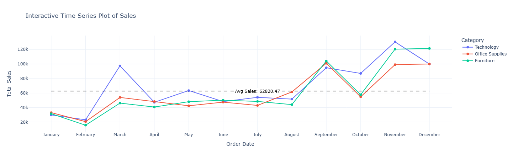

# **E-commerce-Sales-Analysis-2015-2018-USA**

## **📌Project Description**
This project presents a comprehensive analysis of e-commerce sales data in the United States between 2015 and 2018, using Python and its data analytics ecosystem

The goal is to uncover meaningful insights into how different factors—such as time, customer segments, product categories, and geographic regions—influence sales performance. Through exploratory data analysis (EDA), visualization, and strategic interpretation, we aim to guide data-driven business decisions

### **📈 Sales Trends Over Time**

